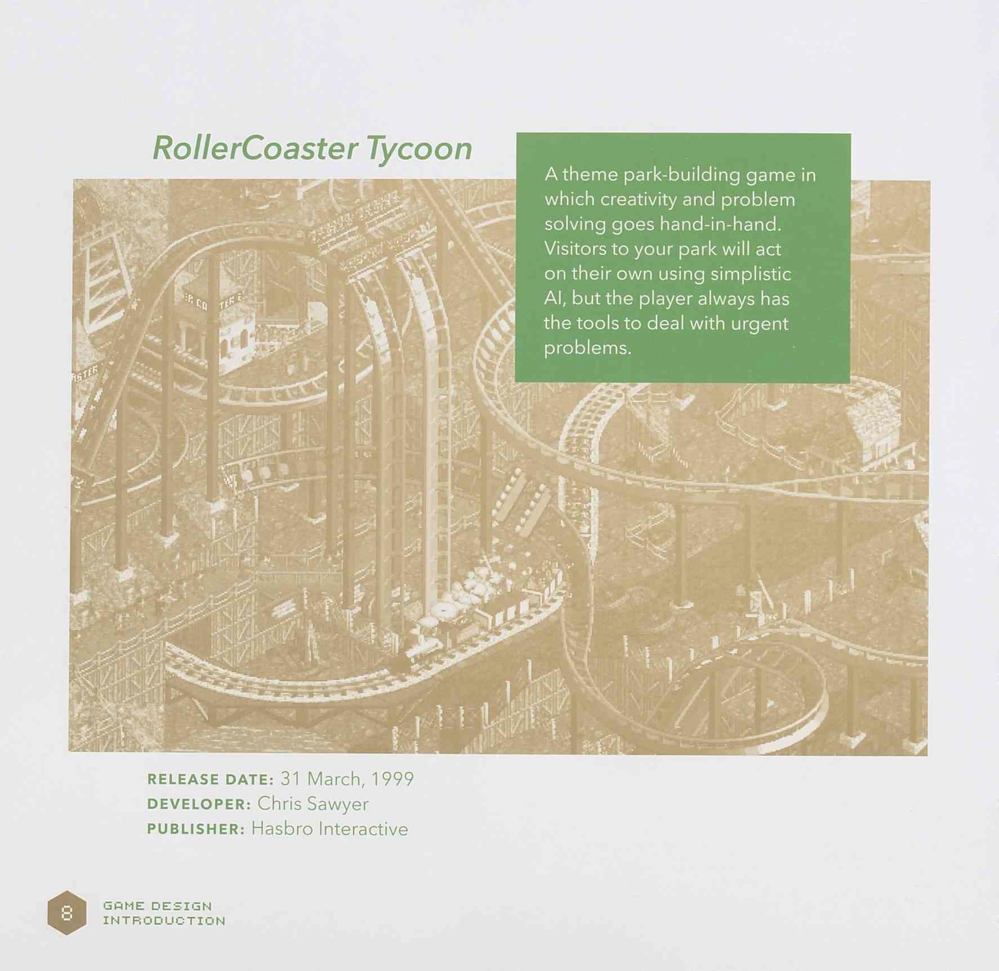

# Игровой дизайн Minecraft

ЙЕНС БЕРГЕНСТЕН

| Страница | Глава                                      |
| -------- | ------------------------------------------ |
| 4        | [Введение](#introduction)                  |
| 12       | [Что такое Minecraft?](#what_is_minecraft) |
| 34       | [Основные принципы](#guiding_principles)   |
| 80       | [Анекдоты](#anecdotes)                     |

<h2 name="introduction">ВВЕДЕНИЕ</h2>

Добро пожаловать! Если вы читаете эту книгу, вы, вероятно, прямо или косвенно работаете с франшизой Minecraft. В этой брошюре дается информация о предыдущих решениях по игровому дизайну, а также о тех, которые будут влиять на будущий дизайн. Описанные здесь принципы и правила относятся в основном к "ванильной" игре, но также могут помочь в разработке других продуктов, связанных с Minecraft.

Данное руководство будет обновляться по мере изменения наших взглядов на развитие Minecraft. Мы надеемся, что вы найдете его информативным.

В качестве отказа от ответственности хочу отметить, что эта статья написана от первого лица "я", поскольку это моя интерпретация того, что такое Minecraft. Цель не в том, чтобы приписать себе все заслуги Minecraft, а в том, чтобы указать на то, что эти оценки часто субъективны и могут быть предметом споров. Игровой дизайн во многом определяется вкусом и опытом человека в играх.

Мы с Нотчем работали над Minecraft около года, и я пытался вспомнить, что именно он упоминал в качестве источника вдохновения. Он приводил примеры игр, рассказывал, какие особенности геймплея ему нравятся, и задавал направление для вселенной Minecraft. Он часто упоминал Dwarf Fortress, RollerCoaster Tycoon и Dungeon Master. По-настоящему гениальным было совместить это направление с моделью взаимодействия Infiniminer. 

Я вырос под влиянием продукции Games Workshop, включая 40K, Fantasy Battle, Space Hulk и Warhammer Quest. В качестве игрового дизайнера наибольший след оставили, пожалуй, игры Blood Bowl и Necromunda.

### Dwarf Fortress

**ДАТА ВЫПУСКА:** 8 августа 2006 г.

**РАЗРАБОТЧИК:** Тарн Адамс

**ИЗДАТЕЛЬ:** Bay 12 Games

Dwarf Fortress - это, пожалуй, самый глубокий симулятор в мире. На вас возложена задача выживания клана гномов, вам необходимо заботиться о добыче полезных ископаемых, пивоварении, обороне от гоблинов и психическом здоровье своих жителей. Все это невероятно процедурно генерируется.

---

### RollerCoaster Tycoon

Атематическая паркостроительная игра, в которой творчество и решение проблем идут рука об руку. Посетители вашего парка будут действовать самостоятельно, используя упрощенный Al, но у игрока всегда есть инструменты для решения актуальных проблем.

**ДАТА ВЫПУСКА:** 31 марта 1999 г.

**РАЗРАБОТЧИК:** Крис Сойер

**ИЗДАТЕЛЬ:** Hasbro Interactive

---

### Dungeon Master

Первая трехмерная ролевая игра, использующая механику реального времени. Традиционная фэнтезийная игра, на которую часто ссылался Нотч, и источник вдохновения для одной из моих любимых франшиз - Eye of the Beholder.

**ДАТА ВЫПУСКА:** 15 декабря 1987 г.

**РАЗРАБОТЧИК:** Даг Белл, Энди Ярос, Уэйн Холдер

**ИЗДАТЕЛЬ:** FTL Games

---

### Infiniminer

Игра Infiniminer была опубликована на форумах The Independent Gaming Source и стала прорывным вдохновением для всей модели взаимодействия в Minecraft. Пусть это была очень простая игра, но она помогла создать нечто удивительное. С тех пор Зак продолжает выпускать множество успешных игр.

**ДАТА ВЫПУСКА:** 29 апреля 2009 г.

**РАЗРАБОТЧИК:** Зак Барт

**ИЗДАТЕЛЬ:** Zachtronics Industries

---

В третьем издании Blood Bowl - жестокой фэнтезийной игре в американский футбол - Games Workshop отказалась от сложных атрибутов персонажей, связанных с их талантами, и заменила их более удобными для чтения. Например, в третьем издании Лайнмен и Кэтчер имели одинаковую базовую статистику, но у Кэтчера также был навык "Ловля", который добавлял новое поведение при ловле мячей. Этот чистый дизайн пришелся мне по душе и научил ценить, когда правила игры имеют четкую и конкретную цель. Мы должны называть эффекты и различия в игровой механике, а не прятать их в цифрах.

Однако Minecraft - это не настольная игра. Minecraft - это творческая видеоигра, действие которой происходит в бесконечном мире, где можно создать практически все, что только можно себе представить. Вопрос в том, как большая команда разработчиков может справиться с многолетним развитием и множеством обновлений. Давайте начнем с того, что же такое Minecraft? 

\- Йенс Бергенстен

<h2 name="what_is_minecraft">ЧТО ТАКОЕ MINECRAFT?</h2>

### MINECRAFT - ЭТО ИССЛЕДОВАНИЕ

Каждый мир Minecraft уникален и наполнен тысячами вещей, которые можно найти и исследовать. Что находится за этим холмом? Что находится внутри этого дома? Где найти лучшее место для моей виллы? Любопытство является сильной мотивацией для игры и продвижения вперед. Ощущение бесконечности вдохновляет игроков и поражает их воображение. 

Неважно, что большинство игроков никогда не уходят далеко от начальной точки мира - просто сама идея отсутствия границ дает ощущение величия. 

Мы должны стремиться к тому, чтобы поощрять игроков, которые исследуют мир, не заставляя их воспринимать это как необходимость. Далее я еще вернусь к этому вопросу: находить вещи - это весело, а искать - нет.

### MINECRAFT - ЭТО ПРИКЛЮЧЕНИЕ

В процессе исследования игроков всегда ожидает что-то интересное и полезное. Создайте свое снаряжение, чтобы подготовиться к путешествию. Сражайтесь со страшными монстрами и собирайте добычу. Исследуйте подземелья и находите сокровища.

Опасности и риски отвлекают от этих наград, но награды открывают новые возможности и повышают способность игроков решать новые задачи. Такая обратная связь позволяет игрокам придумывать свои собственные миссии и квесты и обеспечивает достижение общей цели - победить дракона Эндера. 

Мы должны постоянно ставить перед игроками новые задачи, но при этом задачи должны давать адекватное вознаграждение. Баланс часто бывает трудно найти.

### МАЙНКРАФТ - ЭТО ТВОРЧЕСТВО

Одна из самых интересных вещей в Minecraft - это то, как она вдохновляет на творчество. Как только вы научитесь создавать небольшой домик, вы поймете, что можете строить замки, мосты, большие пирамиды или даже современные имитации аэропортов или футбольных стадионов. 

Творчество - это прекрасная возможность самореализации и удовлетворения, а также создание социальной среды для совместного использования и наслаждения чужими работами. Творчество в Minecraft не ограничивается конструированием, но и включает в себя рассказывание историй, ролевые игры, искусство, 

### MIMNECRAFT - ЭТО ИНЖЕНЕРИЯ

Нотч разработал некоторые системы в Minecraft именно с учетом инженерного подхода, такие как красный камень и механика земледелия. 

Эти системы создают геймплей, основанный на понимании того, как работает игра. В других областях, например, в том, как монстры появляются ночью, игроки могут оптимизировать свой прогресс и "эксплуатировать" правила игры хитроумными способами. 

С тех пор мы добавили больше инструментов и моделей поведения для игроков. В качестве примера можно привести хопперы, блоки слизи и даже способ культивирования растений хоруса. Не стоит забывать, что некоторые люди выражают свою креативность в форме логики и технологий. Нет ничего лучше, чем перехитрить игру.

### MINECRAFT - ПОСТОЯННЫЙ 

Легко принять это как должное, но каждый раз, когда игрок удаляет блок, он оставляет неизгладимый след в этом мире. Блоки попадают в инвентарь игрока, и со временем десятки сундуков наполняются землей и камнем. Разрушение блока за блоком иногда может показаться изнурительным занятием, но получение мизерных сумм способствует развитию психологии накопительства. 

Нужно помнить, что иногда путешествие интереснее места назначения. Великий замок не был бы таковым, если бы появился по нажатию одной кнопки.

### MINECRAFT БЕЗГРАНИЧЕН

В Minecraft нет границ и нет конца. Ваш замок всегда может стать еще более величественным, поля пшеницы - простираться за горизонты, а вы можете попытаться терраформировать весь Нижний мир. Такие стремления могут быть излишне амбициозными, но никогда не будут бессмысленными. 

Никто не может повлиять на то, как игроки будут развлекаться в Minecraft. Многочасовая добыча полезных ископаемых может быть успокаивающей и медитативной, а когда вы выходите из этого состояния, то, возможно, создадите нечто потрясающее.

### MIMNECRAFT - ЭТО СТРАШНО

Копать под землей часто бывает очень напряженно. Не только монстры в темноте, но и лавовые бассейны, пещеры и жуткие звуковые эффекты усиливают напряжение. Опасность потерять все свое оборудование в пустоте во время строительства в конце концов нервирует. Мало того, что нужно беспокоиться о собственной безопасности, так еще и монстры угрожают тому, что вы кропотливо строили.

Не стоит забывать о том, что игроки должны быть активными и вовлеченными. Равнодушие - худший враг, чем криперы.

### MIMNECRAFT - ЭТО ПРОСТО

Художественный стиль Minecraft - это результат простоты и придания миру легко узнаваемой индивидуальности. Блочные персонажи и текстуры низкого разрешения могут иногда ограничивать определенную экспрессию, но косые глаза свиней, коровы, ошарашенно смотрящие на игроков, и густые брови разбойников - все это создает неповторимое ощущение вселенной. Мы иногда называем это "уродливой симпатичностью". 

Мы поддерживаем низкий барьер для сообщества в создании новых текстур и моделей. Каждый должен чувствовать, что он может создать свое собственное животное или монстра для игры, и чтобы это было актуально. В то же время мы должны выяснить, что заставляет животное оживать. Это могут быть такие простые вещи, как наклон головы у волка, кувыркание панды или забавные звуки, издаваемые шалкерами.

### MIMECRAFT - ЭТО СМЕШНО

Многие вещи, представленные в Minecraft, немного глупы. Чаще всего они попадают в игру просто потому, что нам это нравится. Хмурое лицо блока наблюдателя, голова дракона Эндера и то, как выглядят кровати, если надеть их на голову игрока (с помощью команд). 

Хотя для постороннего человека это выглядит смешно, персонажи Minecraft относятся ко всему очень серьезно. Абсурд похож на юмор Монти Пайтона: снежному голему все равно, что его лицо выглядит нелепо, когда он участвует в бою, а хм жителей деревни для них реален. 

Во вселенной, которая может быть страшной, а иногда и мрачной, мы должны позволить себе немного повеселиться.

### MIMECRAFT - ЭТО МУЛЬТИВСЕЛЕННАЯ

Каждый мир Minecraft не разделен ни пространством, ни временем; они сосуществуют в своих уникальных реальностях, и то, что происходит в одной, не влияет на другую. Если есть "до" или "после", то это будет нечто иное, чем "ванильный" Minecraft. 

Эта концепция может открыть несколько вопросов для наших смежных проектов. Происходит ли история в конкретном мире или она имеет отношение к мультивселенной Minecraft? Точнее, является ли игра спин-оффом, расширяющим историю, или это отдельное событие, происходящее в одном из множества миров? 

В основной игре лучше быть неконкретным и общим, чтобы соответствовать всем возможностям, но статичный сюжет может иметь больше деталей, например, именные персонажи и предметы.

<h2 name="guiding_principles" >ОСНОВНЫЕ ПРИНЦИПЫ</h2>

На следующих страницах я постараюсь изложить несколько рекомендаций и "правил", которые могут помочь при разработке новых функций для Minecraft. Они предназначены для того, чтобы помочь понять причину появления новых функций. Они не являются незыблемыми, и мы оставляем за собой право время от времени нарушать наши собственные правила! 

Полезно помнить, что эти правила предназначены для основной ванильной игры. Функции, созданные для побочных игр, в модах или даже с помощью встроенных команд игры, выходят за рамки этой брошюры. Однако, несмотря на то, что эти рекомендации предназначены для ванильной игры, другие проекты должны очень четко представлять, почему и когда они решают нарушить правила. Эти решения должны приносить пользу и приниматься осознанно.

### ОДИН БЛОК ЗА РАЗ! 

Главный принцип заключается в том, что все операции взаимодействуют с одним блоком за один раз. Вы ломаете один блок, тянете один рычаг и пашете один блок грязи. Не должно быть никаких функций копирования-вставки, шаблонов построения или подобных удобных инструментов. Конечно, взаимодействие с блоком может повлиять на множество других блоков, например, посадить дерево, взорвать TNT или активировать сеть из красного камня, но с точки зрения игрока все начинается с этого единственного взаимодействия.

Почему это важно? Это позволяет нам сохранить модель взаимодействия в Minecraft, но при этом накладывает существенное ограничение на то, как вы строите вещи вместе с другими игроками. Я хочу, чтобы игрок понимал, что происходит, когда он видит, как играет кто-то другой. Мгновенное размещение зданий с помощью шаблонов затруднит помощь для наблюдателя.

### НЕТ НИ СТИВА, НИ АЛЕКС

Стив и Алекс предназначены для замещения игроков. Игрок должен создать свою собственную кожу и придумать свою собственную историю. Игроки играют самих себя или, возможно, персонажа, который вписывается в их уникальный мир.

Мы используем Стива и Алекс в наших товарах как талисманы Minecraft, но они не должны играть активную роль в побочных проектах или сюжетных линиях.

### НЕ СОВСЕМ РПГ

Поскольку первоначально источником вдохновения для Minecraft послужили такие игры, как Dwarf Fortress и Dungeon Master, она развивалась в направлении фэнтезийной ролевой игры. Однако Minecraft - это не совсем традиционная ролевая игра, и существенным отличием является то, что персонаж игрока не развивает свои навыки с течением времени. Единственное, что определяет возможности игрока, - это предметы, которые он носит с собой, и его знания об игре.

Одно из распространенных заблуждений связано с уровнями, которые игрок получает за победу над монстрами или торговлю с жителями деревень. Это не уровни опыта в традиционном понимании игр, а уровни зачаровывания, которые игрок может использовать для улучшения своего снаряжения.

### НЕПРИЯТНОСТИ СЛУЧАЮТСЯ...

...но виноваты в этом, как правило, игроки. Катастрофы - обычное дело в Minecraft, будь то падение в лаву или разнесенный на куски криперами дом. Суть в том, что эти несчастные случаи происходили, когда рядом были игроки. Избежать подобных опасностей можно, играя по-другому и более внимательно. Игра не должна создавать ситуаций, которых невозможно избежать, а если они и возникают, то их последствия должны быть достаточно незначительными.

Убедиться в справедливом отношении к игроку - одна из причин, по которой худшим стихийным бедствием является (относительно спокойный) удар молнии, а список блоков, которые берут эндермены, ограничен естественными и доступными блоками, такими как земля и камень. Если игровая механика собирается уничтожить часы кропотливой работы игроков, то инициаторами должны быть игроки, и у них должна быть возможность остановить или даже полностью предотвратить ее.

Один из практических примеров - железные големы игнорируют криперов, потому что иначе крипер взорвется и разрушит здания без какого-либо взаимодействия с игроком.

### НОВЫЕ ВОЗМОЖНОСТИ ДОЛЖНЫ БЫТЬ УВАЖИТЕЛЬНЫМИ ПО ОТНОШЕНИЮ К СУЩЕСТВУЮЩИМ

Новые возможности должны приспосабливаться к балансу других возможностей. "Другое" интереснее, чем "лучшее", и это справедливо как для геймплейных механик, так и для показателей мощности. Настроение и геймплей городов Края сильно отличаются от того, что можно найти, например, в подводной крепости.

### ПРЕДМЕТЫ ДОЛЖНЫ БЫТЬ МНОГОФУНКЦИОНАЛЬНЫМИ 

Инвентарь игроков и так уже перегружен сотнями предметов, существующих в Minecraft. Когда мы добавляем в инвентарь еще больше предметов, нам следует хорошо подумать, можно ли сделать их многоцелевыми или с более широким применением. 

Например, тотем бессмертия имеет только одно применение, но оно достаточно сильно влияет на игровой процесс. Иногда решением проблемы становится еще один ингредиент для варки зелий, но часто лучшим вариантом является предоставление игрокам декоративного блока для крафтинга. 

### ИГРОКИ САМИ СОЗДАЮТ МИР 

Когда мы добавили деревни в бета-версию Minecraft, мы приняли сознательное решение, что они не будут развиваться автоматически. Жители деревень не будут строить дома, и не будет никакой механики для добавления новых зданий на основе шаблонов. Если деревне понадобится защитная стена, игроки должны будут построить ее сами.

Minecraft предлагает игрокам обстановку, с которой они могут взаимодействовать, но что, когда и где происходит, решают сами игроки.

### ВЫ НЕ НОСИТЕ HUD 

По возможности мы должны стараться описывать происходящее с помощью объектов игрового мира, а не полагаться на текстовые сообщения или головной дисплей. Хорошими примерами объектов, отображающих информацию во внутреннем мире, являются карта, компас и часы. Отказ от использования Ul и текстовых сообщений может стать настоящей проблемой при проектировании взаимодействия. 

Лично я также являюсь противником "экрана отладки F3". Я не хочу, чтобы игроки знали или заботились о таких компонентах игрового движка, как координаты, состояние блоков или уровень освещенности. Если они важны для игры, мы должны разработать инструменты для работы с ними в персонаже. 

### НАХОДИТЬ ВЕЩИ - ЭТО ВЕСЕЛО. ИСКАТЬ ИХ - НЕТ 

Если мир Minecraft бесконечен, то можно быть уверенным, что все, что может существовать, существует, но вопрос в том, как найти то, что вам нужно. Беспорядочное блуждание в поисках последнего обновления может сильно разочаровать. Мы хотим удивлять игроков и вознаграждать их за исследования, но при этом мы должны быть уверены, что предоставляем игрокам разумные способы поиска. Карты для поиска лесного особняка, глаза Эндера и колонны пузырей, ведущие к подводным руинам, - вот несколько примеров того, как этого можно добиться.

### РЕАЛЬНЫЕ ЖИВОТНЫЕ ДОЛЖНЫ БЫТЬ ДРУЖЕЛЮБНЫМИ 

Животные в Minecraft должны быть дружелюбными или, в худшем случае, нейтральными. Разрешение животным оставаться дружелюбными сделано отчасти в пользу направления "уродливой симпатичности", но также и для того, чтобы дать их игрокам на мирном уровне сложности. 

Некоторые животные все еще могут защищаться, например, волки и белые медведи, но настоящую опасность представляют ночные монстры. 

### ВРАЖДЕБНЫЕ МОБЫ ДОЛЖНЫ БЫТЬ УНИКАЛЬНЫМИ

У нас есть возможность создать совершенно новую мифологию, и мы должны ею воспользоваться. При создании враждебных монстров не ограничивайтесь традиционными фэнтезийными зверями, такими как минотавры и единороги, а постарайтесь создать нечто уникальное. 

Нежить выполняет свою функцию, поскольку дает игрокам эталонного врага, с которым они могут сравнивать других монстров. Знаковый дракон - одна из наиболее традиционных вещей, которую Нотч хотел добавить. В дальнейшем мы можем попробовать множество других вещей.

### МОБАМ НУЖНА ИНДИВИДУАЛЬНОСТЬ

Очень важно уловить суть личности моба, независимо от того, враждебный это монстр или дружелюбное животное. Визуальные эффекты, звуки и поведение мобов - все это формирует отношение игроков к этим существам.

Самое простое - убедиться, что у них есть глаза и что они смотрят на игроков, когда те находятся рядом. Звуковые эффекты также очень помогают, но помимо этого, каждый моб должен иметь хотя бы одно поведение, которое выделяет его среди других. Ламы плюются, шулеры выглядывают, а оцелоты подкрадываются к курам - вот несколько примеров. 

### ЧЕЛОВЕЧЕСКИЕ ПЕРСОНАЖИ - ЭТО ЛЮДИ

Стив и Алекс - это условные обозначения игроков, других человеческих персонажей в Minecraft не существует. Только человеческие существа (игроки) могут выглядеть как люди.

Есть несколько исключений: в Minecraft: Education Edition мы добавили больше скинов жителей деревень, чтобы помочь с обучающими NPC, а в Minecraft: Story Mode концепция заключается в том, что все персонажи являются "игроками на сервере".

### НЕТ КРОВИ

Мультяшное насилие в Minecraft очень заметно, но мы делаем все возможное, чтобы избежать крови в анимации, частицах, текстурах и так далее. Мы изменили текстуры кролика-убийцы и зомби-свиночеловека по сравнению с их оригинальными версиями, чтобы убрать детали крови.

### СОХРАНИТЬ ВАНИЛЬНОСТЬ

Наше сообщество очень творческое и продуктивное. Существует сотни тысяч модов, карт приключений, мини-игр, пакетов текстур, инструментов и многого другого, созданного нашими игроками.

Мы должны помнить, что Minecraft привлекает множество различных типов игроков, которые ищут разные занятия. Мы должны расширять игру "во всех направлениях" и давать сообществу возможность погрузиться в любимые темы.

### НИ ОДИН ПРЕДМЕТ НЕ ЯВЛЯЕТСЯ ПО-НАСТОЯЩЕМУ УНИКАЛЬНЫМ 

Связывая это с концепцией мультивселенной, мы должны избегать уникальных предметов и персонажей. Конечно, каждый мир и опыт игрока уникальны, но добавление именного оружия, например, арбалета под названием "Heartseeker", добавит точки связи между мирами, что сделает их менее особенными. Это противоречит идее мультивселенной, где все возможности существуют одновременно. 

### РАСШИРИТЬ ТАЙНЫ

В Minecraft существует множество странных и непонятных вещей. Часто они не имеют особого смысла, но это не наша задача - объяснять их. Почему по ночам появляются монстры? Что такое ра? Кто построил крепость? Такие вопросы могут стать отправной точкой для создания истории, и даже если у нас есть своя идея, мы должны держать ее при себе.

### ГЕНДЕРНАЯ НЕЙТРАЛЬНОСТЬ - ГЛАВНЫЙ ПРИНЦИП

При добавлении всех существ и монстров следует исходить из того, что они бесполые или неизвестного пола. В некоторых языках этого очень трудно добиться, но в русском языке мы должны избегать использования таких слов, как "брат", "король" или "герцогиня".

Персонажи игроков представляют собой отдельных людей и, очевидно, могут быть "он" или "она". В этих случаях наша задача - убедиться, что они изображены с равной способностью и целью. 

### СМЕРТЬ РЕАЛЬНА

Мы всегда должны разрабатывать игры с учетом сложности хардкор. Смерть и гибель реальны, и геймплейные механики не должны зависеть от перерождения. Например, однажды было предложено ввести достижение за эффектную смерть, но поскольку на хардкоре этого нельзя добиться, не завершив забег, это предложение было отклонено.

### ОШИБКИ - ЭТО НЕ ОСОБЕННОСТИ 

Странности и глюки часто бывают забавными и очаровательными, но мы не должны полагаться на неопределенное поведение. Легко случайно "исправить" что-то, от чего зависит игрок, если это не реализовано как намеренная функция. 

Исходя из этого, мы исправили буст для рельс и заменили их на электрические рельсы. Мы устранили ошибку с отрицательной прочностью и заменили ее тегом "неразрушаемый" предмет. 

### MINECRAFT - ЭТО НЕ РЕДАКТОР

Мы должны помнить, что Minecraft - это игра. В ней нужно ломать и ставить блоки, находить сокровища, накапливать предметы и защищаться от ночных монстров. Вы включаете творческий режим, чтобы строить вместе с друзьями и весело проводить время. Наряду с принципом "один блок за раз" мы не должны позволять игровым правилам, командным блокам или страницам настроек отвлекать людей от сути того, что они хотят получить от Minecraft.

При этом не удивляйтесь, если в будущем в игре появится "режим редактора". Мы создаем игру, но сообщество также создает опыт для других игроков, и мы позволяем это делать там, где это возможно.

<h2 name="anecdotes">АНЕКДОТЫ</h2>

За годы создания Minecraft мы собрали множество интересных фактов об изменениях и улучшениях. В следующем разделе я случайно выбрал несколько анекдотов, которые могут показаться вам забавными или интересными. 

### ТРАГИЧЕСКАЯ СУДЬБА ЦВЕТКА РОЗЫ

В рамках "Обновления, изменившего мир" мы добавили новые цветы, такие как ромашка, лук-батун и тюльпан. Я также хотел добавить цветок пиона, но один из участников сообщества указал, что пионы - это цветущие кустарники, а не цветы. Я сказал, что то же самое относится и к розам, и другой член сообщества язвительно заметил: "Интересно, кто может это исправить?". 

Они бросили перчатку, и цветок розы превратился в мак. Мы вернули розы на место в качестве кустарников с двойным блоком, но сообщество по-прежнему проводит день "Помни о розе", наполовину в шутку, наполовину всерьез.

### ЗЛЫЕ ЖИТЕЛИ 

Minecraft: Dungeons - это краулер, действие которого разворачивается в среде Minecraft. Этому проекту требовалось значительно больше враждебных монстров, чем те, что есть в ванильной игре, и мы придумывали различные концепции для решения этой проблемы. 

Все было бы гораздо проще, если бы у нас был общий злой персонаж, и это привело к созданию "evil villagers". Мы назвали этих врагов "ill-willed villagers", или "illvillagers", но предлагались и "evillagers", и просто "illagers". Мы выбрали самый короткий вариант, и, наверное, он оказался самым веселым. Если вы говорите по-шведски, то правильным переводом будет "fybo" ("плохой житель деревни"), поскольку он создает тот же смысл и использует тот же каламбур из "bybo" ("житель деревни"). 

Разбойники полезны для создания побочных и связанных с ними историй. Они могут иметь любую программу действий или любые навыки, необходимые для развития сюжета, хотя эти навыки должны быть скорее "магическими", чем инженерными.

### ПОВТОРИТЕЛЬ КРАСНОГО КАМНЯ

Повторитель красного камня был первым специализированным блоком, добавленным для конструкций с красным камнем. Изначально он выполнял роль диода, то есть сигнал красного камня проходил через него только в одном направлении. 

Повторитель также выполнял роль задержки, и поскольку у нас было несколько дополнительных битов данных, я сделал задержку настраиваемой. Первоначальными значениями были 1, 2, 5 и 7 тиков Редстоуна, поскольку для создания всех задержек от 1 до 10 требовалось наименьшее количество повторителей. Сообщество указало, что для задержек вплоть до 12 лучше использовать значения 1, 2, 5 и 6, но в итоге я выбрал 1, 2, 3 и 4, поскольку они более просты и понятны.

### МАЯК

Однажды я зашел на сервер с режимом "Выживание" просто ради интереса, и игроки в этом мире достигли всего, чего только можно. У них были все предметы, все фермы монстров, и они построили потрясающие здания. Я почувствовал, что для таких игроков нужно что-то, что требовало бы больше "добычи" и командной работы. Этот опыт привел к созданию блока маяка и "дорогой" пирамиды из драгоценных металлов и камней, на которой он стоит. 

Однако игроки перехитрили эту систему и воспользовались тем, что в больших деревнях автоматически генерируются железные големы. Они получали все необходимые материалы не за счет добычи, а за счет автоматизации. 

Мы придумали награду (маяк) до того, как придумали трудность, связанную с ее получением (визер). Зачастую придумывать задачи гораздо естественнее, чем награды, поскольку они меньше влияют на общий баланс игры.

### ДРЕВЕСНЫЙ УГОЛЬ

В старые добрые времена в режиме "Выживание" очень важно было как можно быстрее найти уголь. Уголь открывал факелы, а затем и шахты, что позволяло игроку пережить ночь. Когда мы добавили древесный уголь, то с меньшими усилиями можно было найти источник света везде, где есть деревья. Иными словами, древесный уголь оказал довольно значительное влияние на дерево технологий и метагеймплей игры. 

Обычно мы стараемся не нарушать ход развития игры в рамках новых возможностей. Мы предпочитаем расширять или углублять дерево технологий, если это возможно. Древесный уголь помог решить проблему и позволить использовать различные стили игры. 

### ЭНДЕРМЕНЫ 

Мы никогда не хотим объяснять игрокам, что такое эндермены. Они - молчаливые наблюдатели, и их загадочное поведение при перемещении блоков должно оставаться тайной. Нотч добавил эндерменов в качестве отсылки к мему о Слендермене, но с тех пор они стали одним из основных элементов истории Minecraft. 

Тайна заключается в том, что они пытаются вызвать коллапс всех измерений, перемещая блоки, которые являются ключевыми для существования мира. Они делают это по одному блоку за раз, уморительно медленно. Но... на их стороне вечность.

---

MOJANG 

TM & © Mojang Synergies AB 

**ТЕКСТ:** Йенс Бергенстен 

**Иллюстрация:** Нинни Ландин, Маркус Тойвонен, Мартин Йоханссон, Антон Стенвалл, Bsmart 

**Дизайн книги:** Маркус Карлссон Фрост 

Первое издание 

Напечатано в Швеции в 2019 г. 

Для внутреннего пользования
